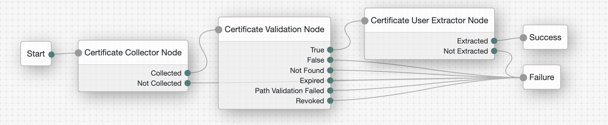

Axiad allows customers to move to a passwordless future without the friction and risk of fragmented solutions. By addressing authentication holistically, regardless of underlying IT complexity, organizations can vastly improve their cybersecurity posture.

# **Axiad Certificate Based Authentication Node**

Certificate-based authentication is one of the most secure, phishing-resistant forms of multi-factor authentication (MFA) and is increasingly deployed in enterprises and the public sector. Many enterprise employees, as well as the majority of federal agency and defense employees/contractors, use a strong token such as a smart card or hardware device for authentication. CBA streamlines the process of authenticating users with a variety of tokens while improving overall protection.

**Note:** 
* These nodes will only work with Access Management 6.5.2 and above.

## Usage

### Installation

1. Download the latest version of the Axiad certificate Based Node from [here](https://github.com/ForgeRock/axiad/tree/main/jar/).
2. Copy the .jar file into the ../web-container/webapps/openam/WEB-INF/lib directory where AM is deployed.
3. Enable Secure http on the container.
4. Enable com.sun.security.enableCRLDP option in your web application container. For example, if you are using Apache Tomcat™, you would add the following to the setenv.sh file (typically located in the /tomcat/bin/ directory):

export CATALINA_OPTS="-Dcom.sun.security.enableCRLDP=true"

4. The web application container in which AM is deployed handles user certificates correctly. For example, for Tomcat, you should set clientAuth to "want" in the server.xml file.
5. Your system's truststore contains the root CA and any intermediate CAs that signed (issued) the client certificates. By default, Tomcat uses the Java truststore provided with the JDK that is in $JAVA_HOME/jre/lib/security/cacerts. For root and intermediate CAs, please contact your Axiad Customer Success representative.
3. Restart the web container to pick up the new configuration. The node will then appear in the authentication trees components palette.

### ForgeRock Configuration
1. Log into your ForgeRock AM console.
2. Create a new Authentication Tree as shown in Example section.
3. Click the Certificate Collector Node and configure the Certificate Collection Method to Either.
4. Click the Certificate Validation Node and configure below options
   4.1. Enable Check Certificate Expiration option.
   4.2. Enable Match Certificate to CRL option.
   4.3. Enable Cache CRLs in Memory option.
   4.4. Enable Update CA CRLs from CRLDistributionPoint option.
   4.5. Add LDAP Server Where Certificates are Stored.
   4.6. Configure LDAP Server Authentication Password.
   4.7. Enable Use SSL/TLS for LDAP Access.
5. Click Certificate User Extractor Node, and configure SubjectAltNameExt Value Type to Access User Profile to UPN.

 ### Example Flow

 