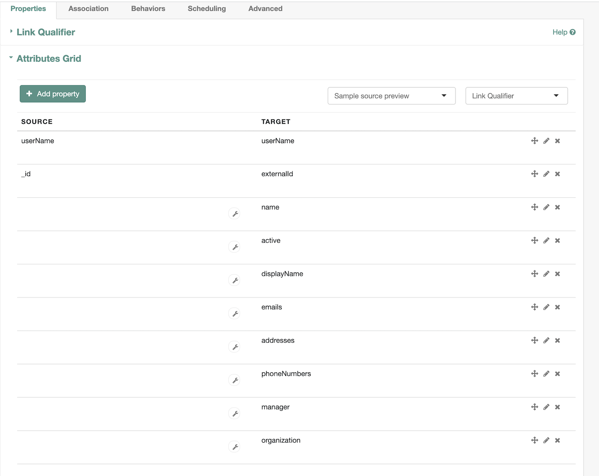
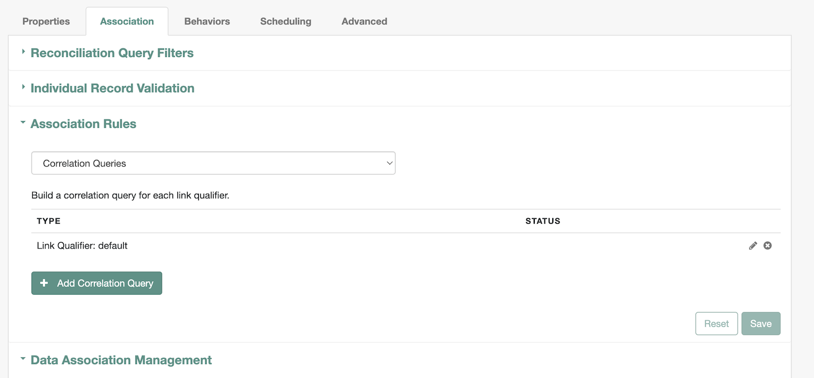
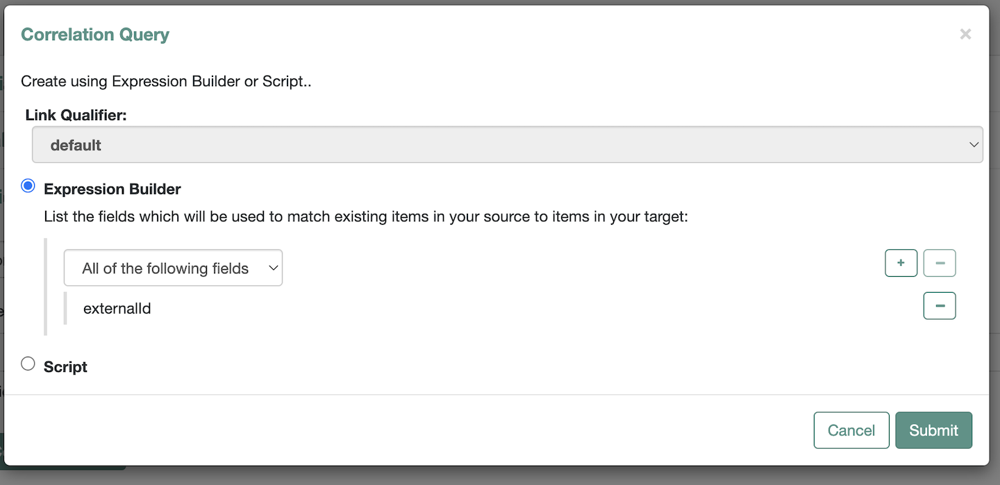
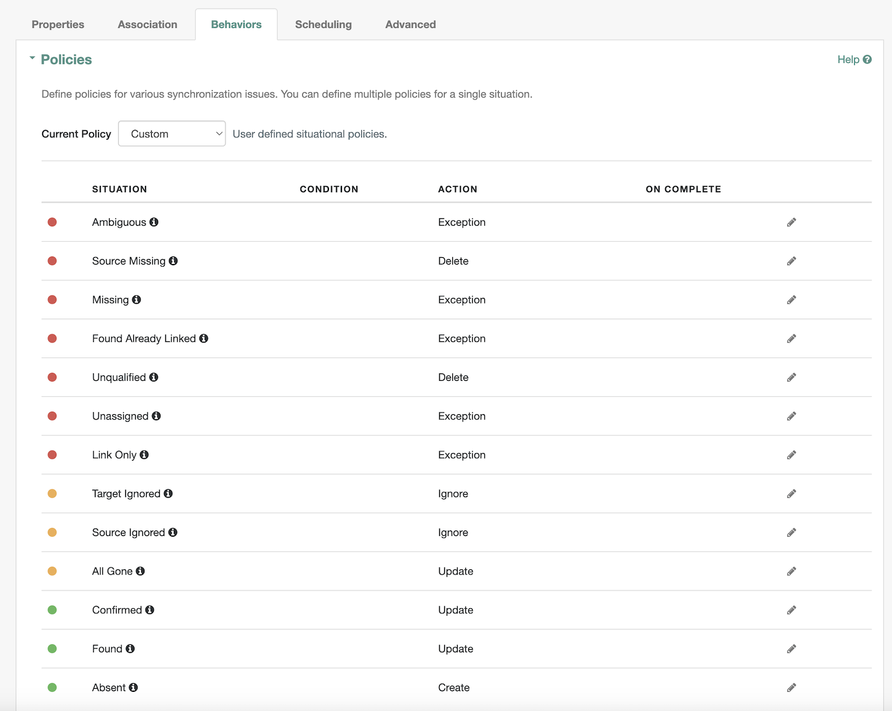
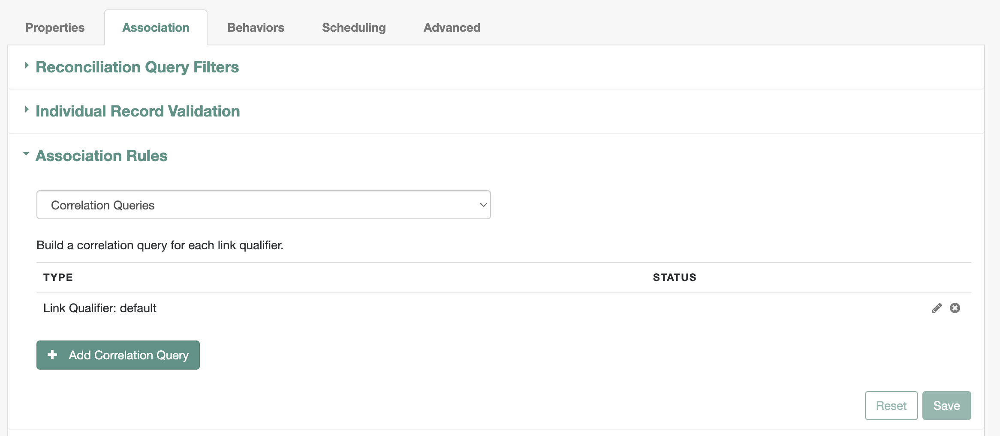
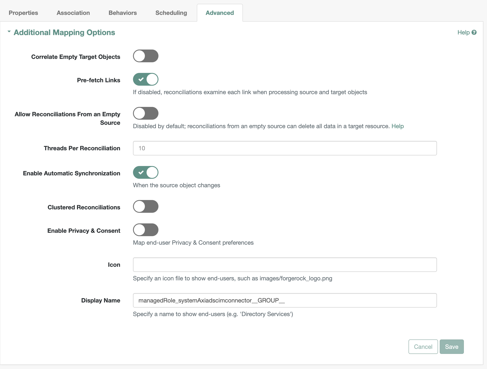
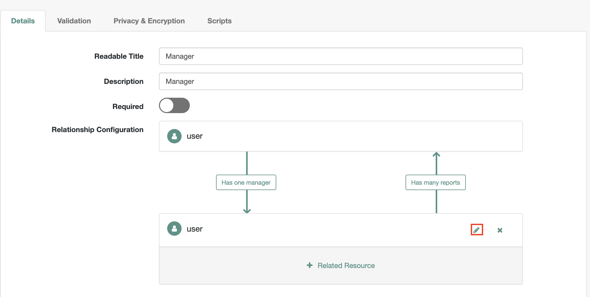
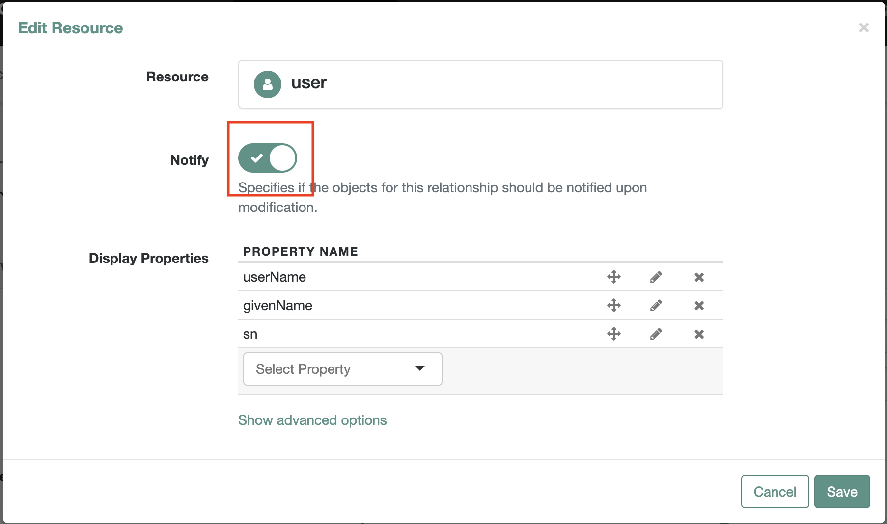
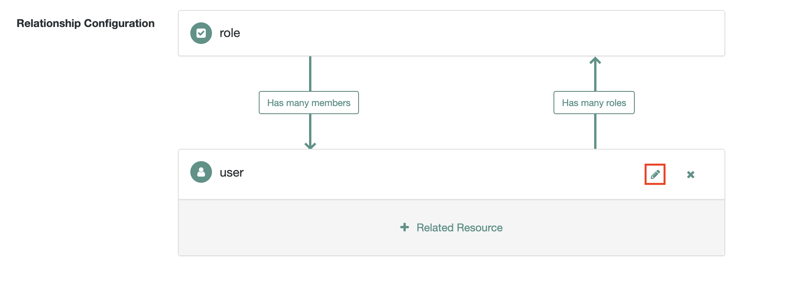

   
 

# Axiad

Axiad enables customers to move to a passwordless future without the friction and risk of fragmented solutions. By addressing authentication holistically, regardless of underlying IT complexity, organizations can vastly improve their cybersecurity posture.

Please refer to our website for more information about [Axiad](https://www.axiad.com/).

## Axiad SCIM Connector

Axiad SCIM Connector enable automatic provisioning of users and groups between Axiad Cloud and ForgeRock using secure and standard protocol, System for Cross-Domain Identity Managemen(SCIM). Axiad SCIM connector allows partners to levarge Certificate Based Authentication, which is the most secure, phishing-resistant forms of multi-factor authentication (MFA) and is increasingly deployed in enterprises and the public sector. Many enterprise employees, as well as the majority of federal agency and defense employees/contractors, use a strong authenticator such as a smart card or hardware device for authentication. CBA streamlines the process of authenticating users with a variety of authenticators while improving overall protection.

## Prerequisites

1. ForgeRock Identity Management (openidm)
1. Axiad Cloud tenant or Axiad Unified Credential Management System (UCMS)
1. Appropriate SCIM connector configurations

## Axiad Configuration

If your Axiad environment is already configured with required mappings in Axiad Unified Credential Management System (UCMS) there is no additional configuration needed. If assistance is needed with your Axiad environment in the following sections please contact [Axiad Customer Success](mailto:customer.success@axiad.com).

## Configuring the SCIM Connector

1. Get the latest SCIM Connector configuration and mapping file from the [Axiad Customer Success Representative](mailto:customer.success@axiad.com).
2. Copy the `provisioner.openicf-AxiadSCIMConnector.json` file into the `conf` directory where ForgeRock Identity Management is deployed.
3. Copy the content of `mapping-AxiadSCIMConnector.json` inside mappings array into `conf\sync.json` file.

## ForgeRock Configuration

### Axiad SCIM Connector Configuration
1. Log into the ForgeRock Identity Management console.
2. Click `CONFIGURE` on the menu bar and select `CONNECTORS`. AxiadSCIMConnector will be avaiable to configure as shown
  
   
4. Click on the Axiad SCIM Connector
   1. Configure the `SCIM Endpoint` under `Base Connector Details` section as shown. If you don't have the SCIM endpoint please contact [Axiad Customer Success Representative](mailto:customer.success@axiad.com).
  
   

   2. Confgiure `Authentication token` under `Additional Options` section as shown. If you don't have the token please contact [Axiad Customer Success Representative](mailto:customer.success@axiad.com).
  
   

   3. Click on save.

### Axiad SCIM Connector mappings Configuration   
1. Click `CONFIGURE` on the menu bar and select `Mappings`. Axiad SCIM mappings will be available as shown below
  
   

#### Users mappings Configuration 

1. Click on `Edit` where SOURCE is `Managed/User` and verify the settings are correct
   1. Verify `Properties` tab has mappings as shown
  
      
   2. Verify `Association Rules` under Association tab has config as shown
  
      
      1. Under `Association Rules`, click on pencil icon to verify the `Correlation Query` config as shown
  
         
   3. Verify `Behaviors` tab has policies as shown
  
      
   4. Verify `Advanced` tab has policies as shown 
  
        
       
2. Under `Scheduling` tab, you can `Add Reconciliation Schedule` as per your organization's requirement.

#### Groups mappings Configuration

1. Click on `Edit` where SOURCE is `Managed/Role` and verify the settings are correct
   1. Verify `Properties` tab has mappings as shown
  
      
   2. Verify `Association Rules` under Association tab has config as shown
  
      
      1. Under `Association Rules`, click on pencil icon to verify the `Correlation Query` config as shown
  
         
   3. Verify `Behaviors` tab has policies as shown
  
      
   4. Verify `Advanced` tab has policies as shown 
  
        
       
2. Under `Scheduling` tab, you can `Add Reconciliation Schedule` as per your organization's requirement.

### Managed Objects Configuration

#### Users
1. Click `CONFIGURE` on the menu bar and select `MANAGED OBJECTS`.
2. Click 'User' managed object

##### Manager property

1. Edit `manager` property 
2. Under `Details`, click on `Show advanced options`
3. Enable all the options( `Viewable`, `Searchable`, `User Editable`, `Nullable`, `Return by Default` and `Notify Self`).
4. Edit `Relationship Configuration`, highlighted with red rectangle as shown

    

   1. Enable `Notify` on `Edit Resource` screen as shown

      

##### MemberOfOrgIDs property
1. Edit `memberOfOrgIDs` property
2. Under `Details`, click on `Show advanced options`
3. Enable `User Editable`, `Return by Default` and `Virtual` options

#### Roles
1. Click `CONFIGURE` on the menu bar and select `MANAGED OBJECTS`.
2. Click 'Role' managed object

##### Members property

1. Edit `members` property 
2. Under `Details`, click on `Show advanced options`
3. Enable `Viewable`, `User Editable`, `Return by Default` and `Notify Self` options.
4. Edit `Relationship Configuration`, highlighted with red rectangle as shown

    

   1. Enable `Notify` on `Edit Resource` screen as shown

      