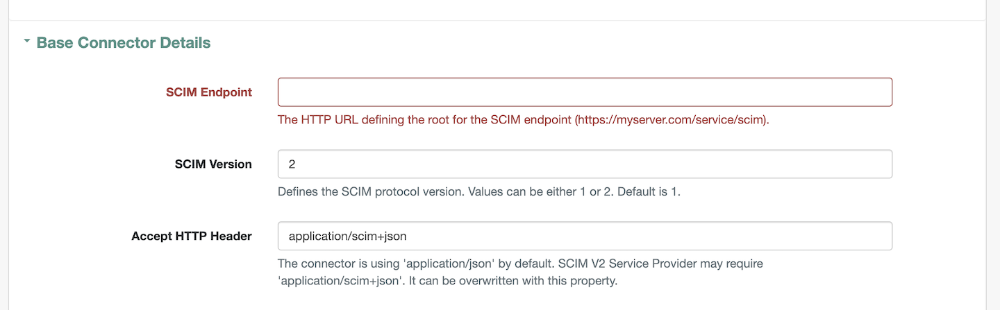
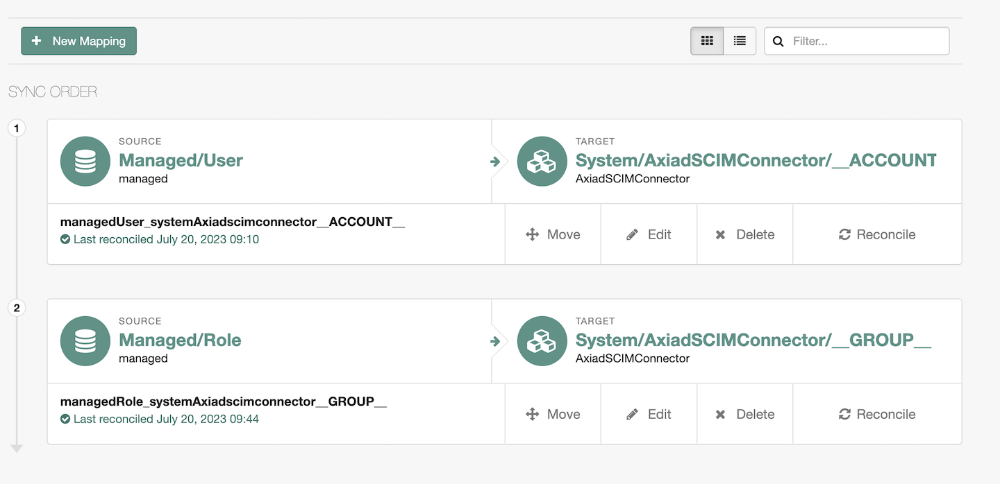
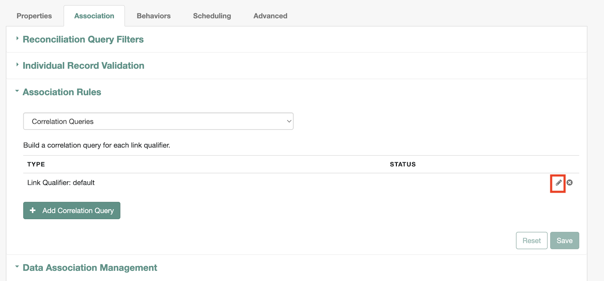
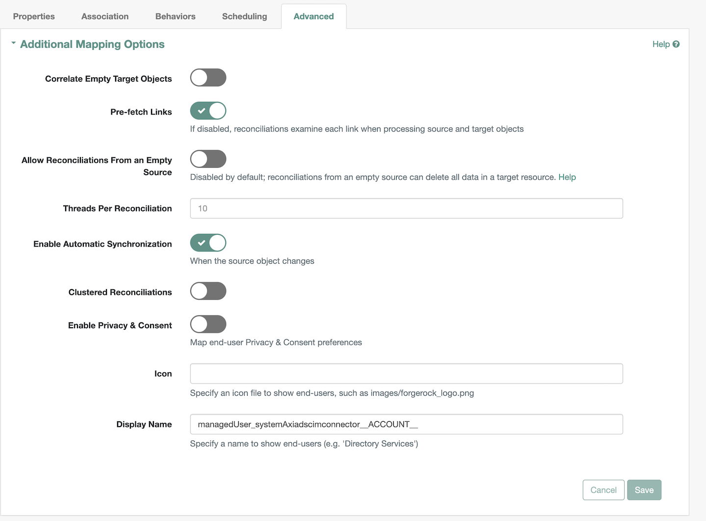
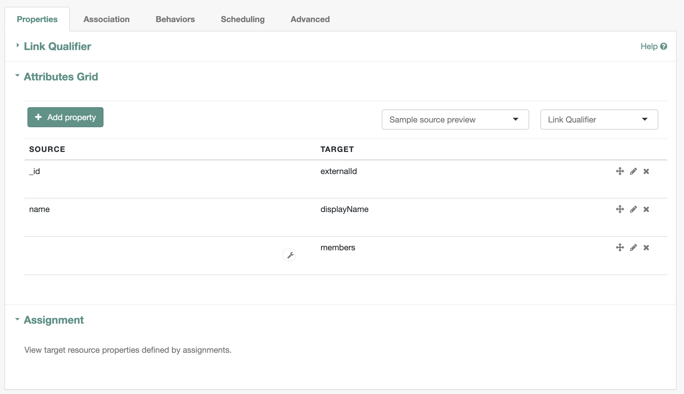
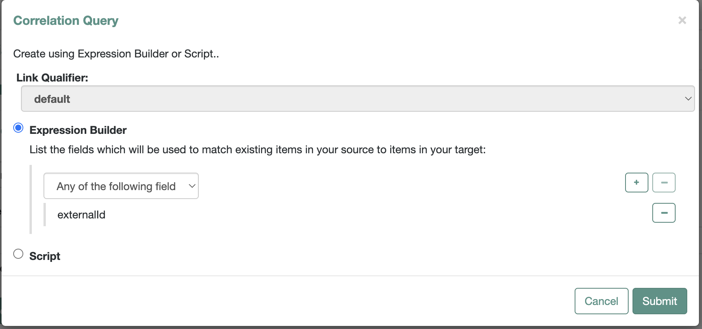
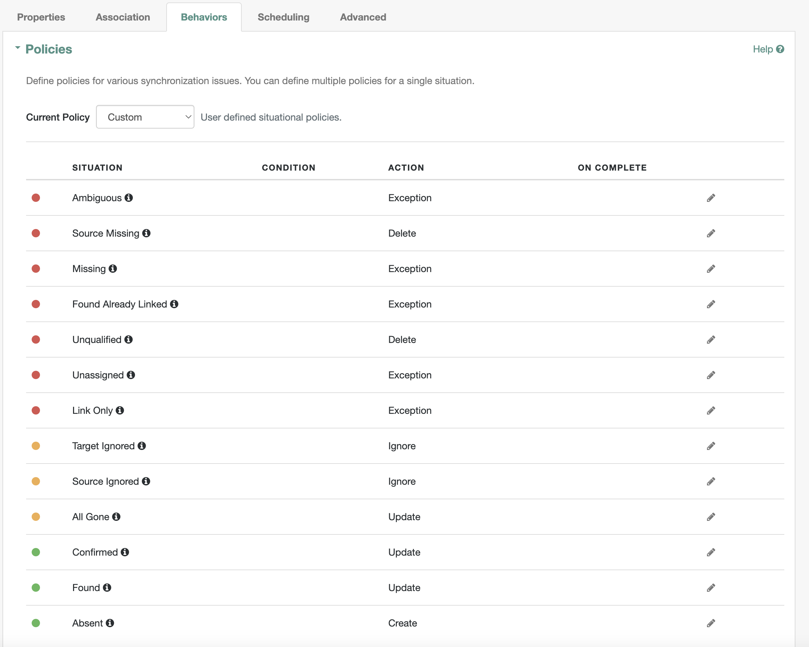
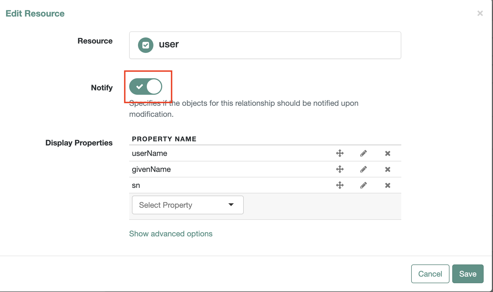

   
 

# Axiad

Axiad enables customers to move to a passwordless future without the friction and risk of fragmented solutions. By addressing authentication holistically, regardless of underlying IT complexity, organizations can vastly improve their cybersecurity posture.

Please refer to our website for more information about [Axiad](https://www.axiad.com/).

## Axiad SCIM Connector

Axiad SCIM Connector enables automatic provisioning of users and groups between Axiad Cloud and ForgeRock using the secure and standard protocol, System for Cross-Domain Identity Management(SCIM). The Axiad SCIM connector allows partners to leverage certificate based authentication, which is the most secure, phishing-resistant form of multi-factor authentication (MFA) and is being increasingly deployed in enterprises as well as the public sector. Many enterprise employees, as well as the majority of federal agencies and defense employees/contractors, use a strong authenticator such as a smart card or hardware device for authentication. CBA streamlines the process of authenticating users with a variety of authenticators while improving overall protection.

## Prerequisites

1. ForgeRock Identity Management (openidm)
1. Axiad Cloud tenant
1. Appropriate Axiad SCIM connector configuration files

## Axiad Configuration

If your Axiad Cloud tenant is already configured with the required mappings attribute there is no additional Axiad configuration needed. If assistance is needed with your Axiad Cloud environment in the following sections please contact [Axiad Customer Success](mailto:customer.success@axiad.com).

## Configuring the Axiad SCIM Connector

1. Get the latest SCIM Connector configuration and mapping file from the [Axiad Customer Success](mailto:customer.success@axiad.com) team.
2. Copy the `provisioner.openicf-AxiadSCIMConnector.json` file into the `conf` directory where ForgeRock Identity Management is deployed.
3. Copy the contents of `mapping-AxiadSCIMConnector.json` into the mappings array inside the `conf\sync.json` file.

## ForgeRock Configuration

### 1. Axiad SCIM Connector Configuration

1. Log into the ForgeRock Identity Management console.
2. Click `CONFIGURE` on the menu bar and select `CONNECTORS`. AxiadSCIMConnector will be avaiable as shown
  
   

3. Click on the `Axiad SCIM Connector`

   3.1. Configure the `SCIM Endpoint` under `Base Connector Details` section as shown. If you don't have the SCIM endpoint please contact [Axiad Customer Success Representative](mailto:customer.success@axiad.com).
  
   

   3.2. Configure `Authentication token` under `Additional Options` section as shown. If you don't have the token please contact [Axiad Customer Success Representative](mailto:customer.success@axiad.com).
  
   

   3.3. Click on save.

### 2. Axiad SCIM Connector mappings Configuration   
   Click `CONFIGURE` on the menu bar and select `Mappings`. Axiad SCIM mappings will be available as showna
  
   

#### _2.1. User mapping Configurations_

1. Click on `Edit` where SOURCE is `Managed/User` and verify the settings are correct

   1.1. Verify `Properties` tab has `Attributes Grid` as shown
  
      

   1.2. Verify `Association` tab has `Association Rules` as shown
  
      

      1.2.1. Under `Association Rules` click on `pencil` icon (as highlighted in above image) to verify the `Correlation Query` config as shown
  
      

   1.3. Verify `Behaviors` tab has `Policies` as shown
  
      

   1.4. Verify `Advanced` tab has `Additional Mapping Options` as shown 
  
        
       
   1.5. Under `Scheduling` tab, you can `Add Reconciliation Schedule` as per your organization's requirement.

#### _2.2. Group mapping Configurations_

1. Click on `Edit` where SOURCE is `Managed/Role` and verify the settings are correct

   1.1. Verify `Properties` tab has `Attributes Grid` as shown
  
      

   1.2. Verify `Association` tab has `Association Rules` as shown
  
      

      1.2.1. Under `Association Rules` click on `pencil` icon (as highlighted in above image) to verify the `Correlation Query` config as shown
  
      

   1.3. Verify `Behaviors` tab has `Policies` as shown
  
      

   1.4. Verify `Advanced` tab has `Additional Mapping Options` as shown 
  
        
       
   1.5. Under `Scheduling` tab, you can `Add Reconciliation Schedule` as per your organization's requirement. 

### _2.3. Managed Objects Configuration_

#### 1. Users

1. Click `CONFIGURE` on the menu bar and select `MANAGED OBJECTS`.
2. Click 'User' managed object

##### 1.1. Manager property

1. Edit `manager` property 
2. Under `Details`, click on `Show advanced options`
3. Enable all the options( `Viewable`, `Searchable`, `User Editable`, `Nullable`, `Return by Default` and `Notify Self`).
4. Edit `Relationship Configuration`, highlighted with red rectangle as shown

    

   4.1. Enable `Notify` on `Edit Resource` screen as shown

      

##### 1.2. MemberOfOrgIDs property

1. Edit `memberOfOrgIDs` property
2. Under `Details`, click on `Show advanced options`
3. Enable `User Editable`, `Return by Default` and `Virtual` options

#### 2. Roles

1. Click `CONFIGURE` on the menu bar and select `MANAGED OBJECTS`.
2. Click 'Role' managed object

##### 2.1. Members property

1. Edit `members` property 
2. Under `Details`, click on `Show advanced options`
3. Enable `Viewable`, `User Editable`, `Return by Default` and `Notify Self` options.
4. Edit `Relationship Configuration`, highlighted with red rectangle as shown

    

   4.1. Enable `Notify` on `Edit Resource` screen as shown

      